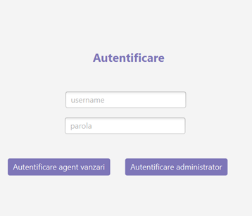
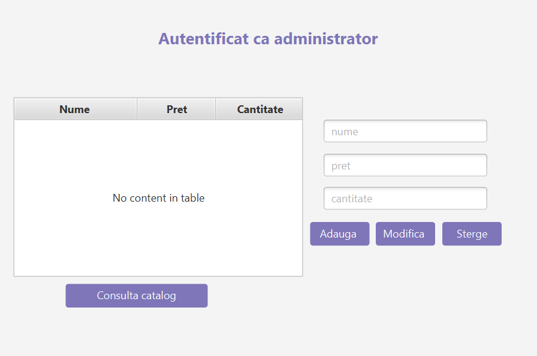
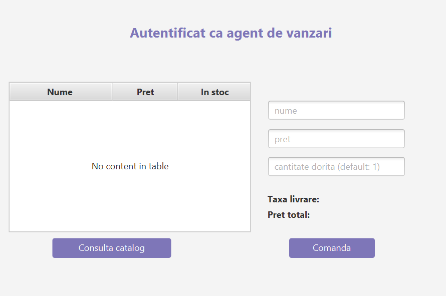
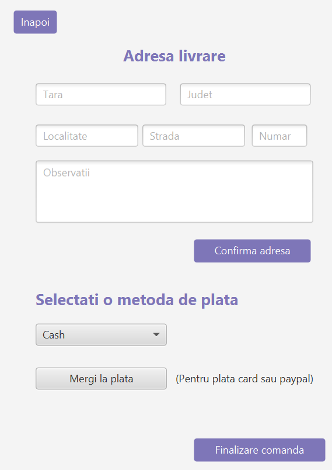

# Software-Engineering - Sales Agents Project

## Overview

This project implements a **Products Ordering System (POS)** designed to streamline product management for sales agents and company administrators. It allows users to manage products, place orders, and process payments in a simplified, easy-to-use interface.

## Features

1. **Authentication**  
   - Both sales agents and company administrators can log in to the POS system securely using their credentials.

2. **Product Catalog Management**  
   - Company administrators can add, modify, or remove products from the catalog.
   - Sales agents can browse the catalog to view product details, stock information, and place orders.

3. **Placing Orders**  
   - Sales agents can place orders by selecting products from the catalog, providing the delivery address, and choosing a payment method (cash, card, or PayPal).

4. **Payment Processing**  
   - Sales agents can select from multiple payment options:
     - Cash
     - Credit Card
     - PayPal

5. **Order Tracking**  
   - Orders are tracked, and stock levels are automatically updated after order placement.

## Use Cases

### UC1: Authentication
- **Actor**: Sales Agent / Company Administrator
- **Description**: A user logs in to access their account and manage products or place orders.
  
### UC2: View Catalog
- **Actor**: Sales Agent / Company Administrator
- **Description**: Users can view the catalog of all available products.

### UC3: Add Product
- **Actor**: Company Administrator
- **Description**: Admins can add new products to the catalog, specifying details like product name, price, and stock levels.

### UC4: Delete Product
- **Actor**: Company Administrator
- **Description**: Admins can remove products from the catalog.

### UC5: Modify Product
- **Actor**: Company Administrator
- **Description**: Admins can update product details, such as price, description, and stock availability.

### UC6: Place Order
- **Actor**: Sales Agent
- **Description**: Agents can place orders by selecting products and providing the necessary shipping and payment details.

### UC7: Payment Processing
- **Actor**: Sales Agent
- **Description**: The sales agent completes the payment for an order, choosing from multiple payment methods.

## Iteration Plan

1. **Iteration 1**:
   - Implement authentication for administrators and sales agents.
   - Implement product catalog consultation.
   - Implement the add product feature.
   
2. **Iteration 2**:
   - Implement product deletion.
   - Implement order placement and delivery details.
   - Implement cash payment.

3. **Iteration 3**:
   - Implement product modification.
   - Implement credit card and PayPal payments.

## UI Prototypes

### Login Page

### Administrator's Dashboard

### Sales Agent's Dashboard

### Order Placement and Payment

